# Good Food Restaurant Reviews website
(Academic Project) Good Food offers comprehensive and honest food reviews from everyday diners.

## Site Navigation Diagram 
 

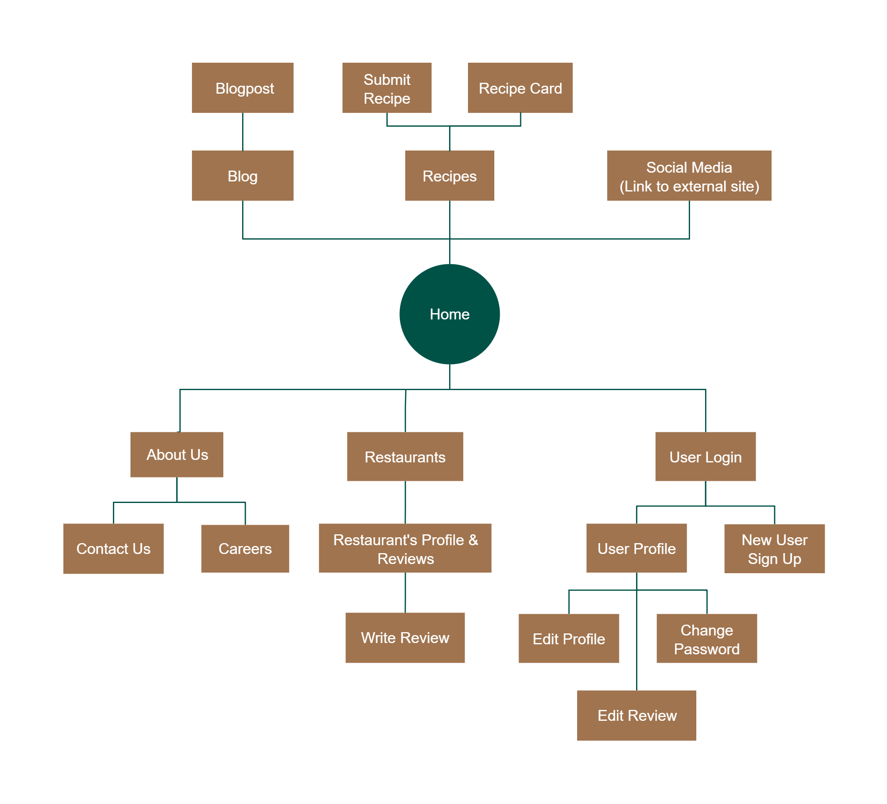

## Functionalities of Web Application
 

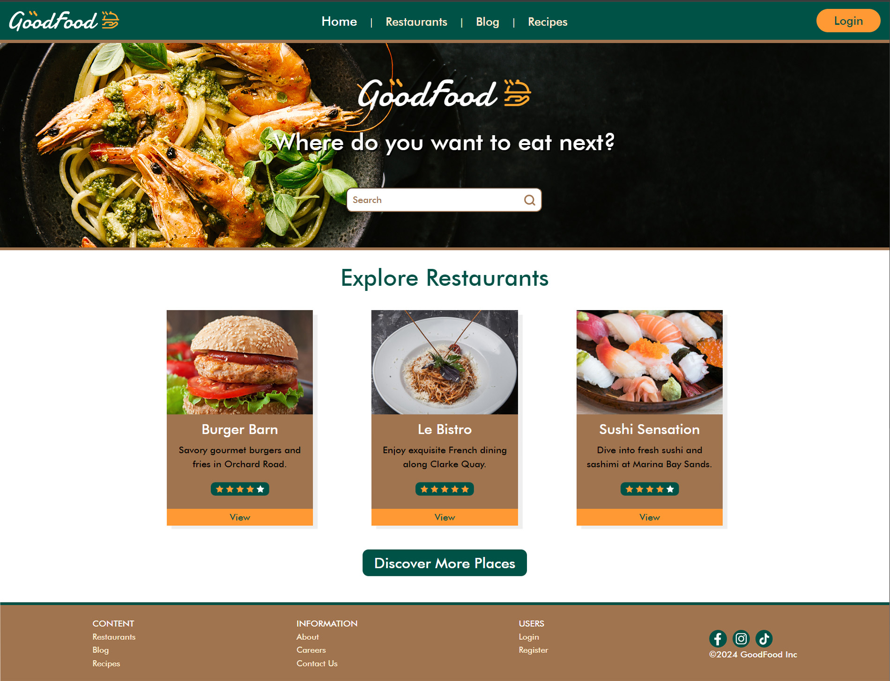

### All Pages

• **Header:** Users can access the primary pages via the links in the header.  

• **Search Bar:** The search bar currently has no functionality.  

• **Footer:** Users can access secondary pages & Good Food’s social media profiles via the quick links in the footer. 

• **CheckUserHome():** Upon loading, a JavaScript function runs to check if there is any user logged in by looking for their UserIDsaved in localStorage. If it's available, their first name will appear in the yellow button in the header, instead of the default ‘Login’. Clicking the button will take them to their profile instead of the login page.

### Home

• **Preview of restaurants:** The page loads 3 random restaurants from the database. Users can click on the view button to visit that restaurant’s profile.  

• **‘Discover More Places’ Button:** Clicking this button will direct users to a page with previews of all available restaurants in the database.  
 

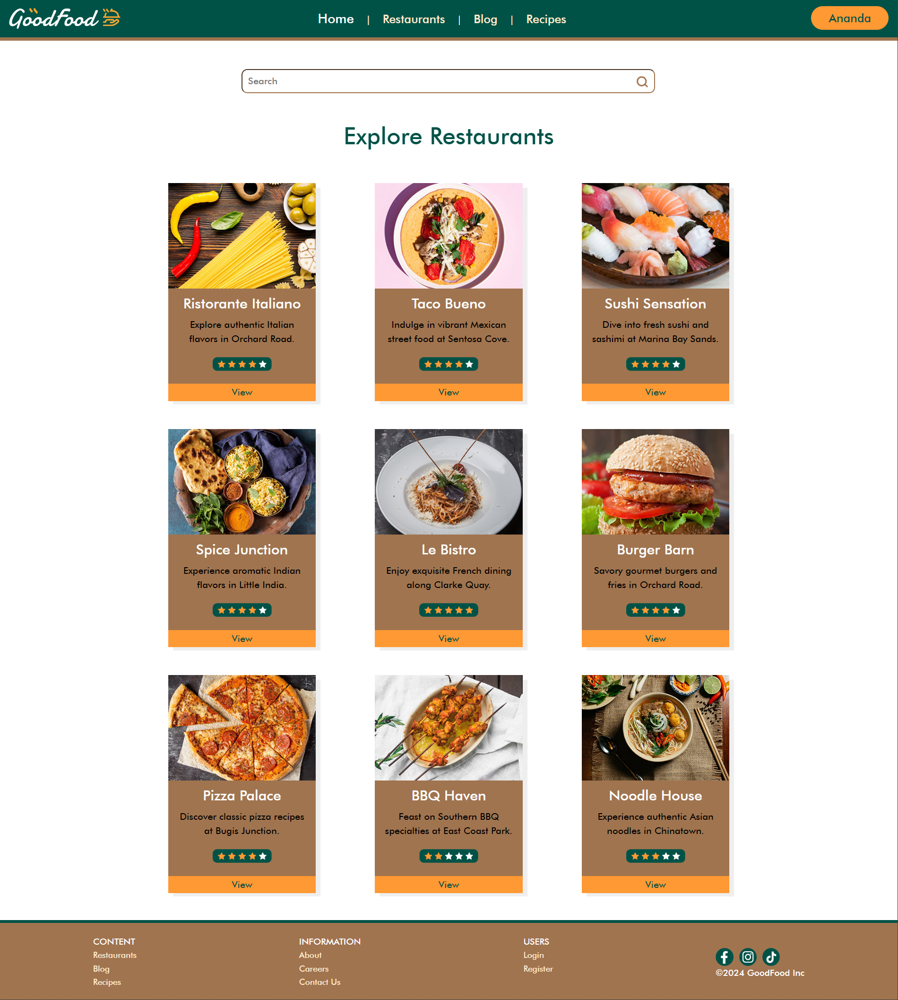

### Restaurants

• **Preview of restaurants:** This page uses JavaScript to load all available restaurants from the database into a grid box. Each grid item holds each restaurant’s name, a short description, average rating and an image. Users can click the view button to view the restaurant’s full profile.  

• **View Button:** When a user clicks any of the view buttons, that restaurant’s id number will be saved in localStoragebefore directing them to the restaurant’s profile & reviews page.

 

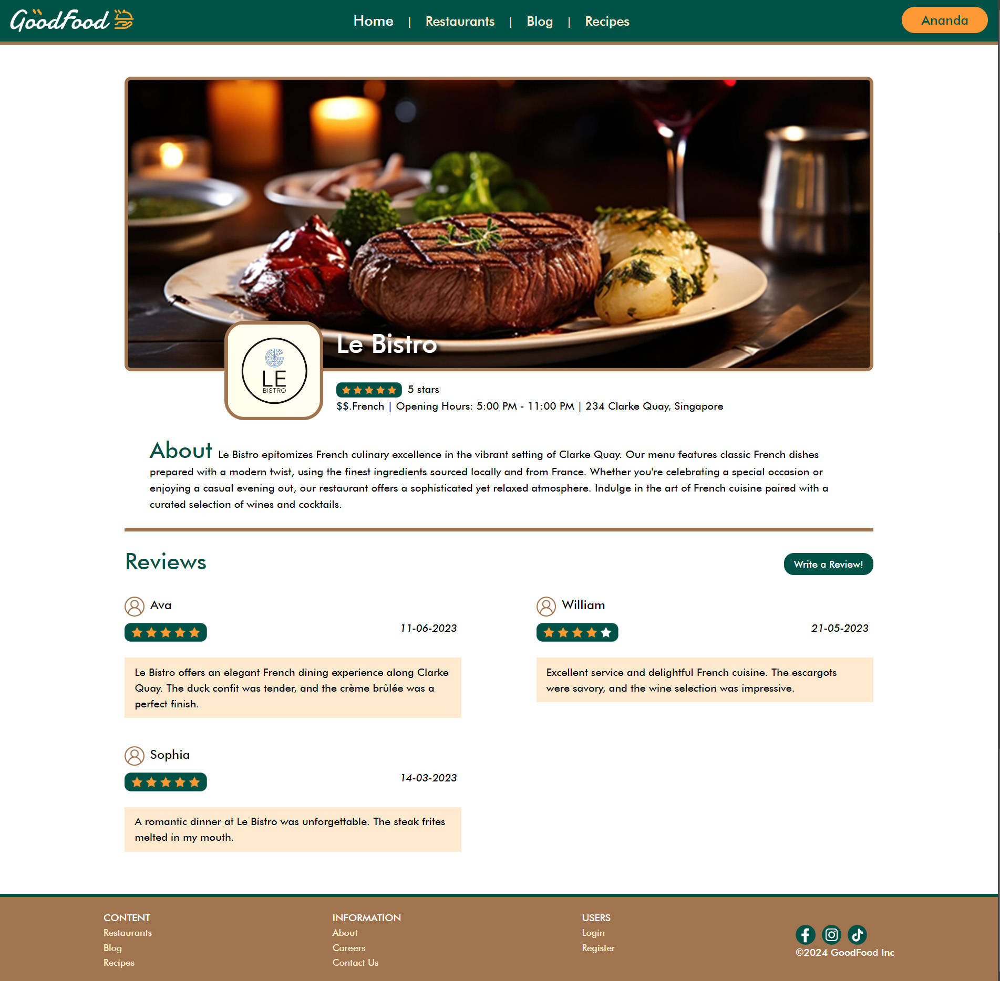

### Restaurant’s Profile & Reviews

• **Restaurant’s Profile with Information:** Using JavaScript and the restaurant’s id number from localStorage, the page will load its profile, details and all reviews. Each restaurant profile will display its name, logo, rating, category, price range, opening hours, address and description. 

• **Reviews:** Each review will display the user’s name, their rating, review, and the date they had posted.

• **Write a Review:** Users can click into this button to submit a review for that restaurant. A JavaScript function will check if they are already logged in. If not, they will be taken to the login page.

 

### Write Review

• **Write Review:** A JavaScript function loads the restaurant’s name using the id saved from the previous page, into localStorage. The user can select the rating by clicking on the stars and input their review into the blank text box before click the submit button, that wll initiate a process to save the review into the 
database.

 

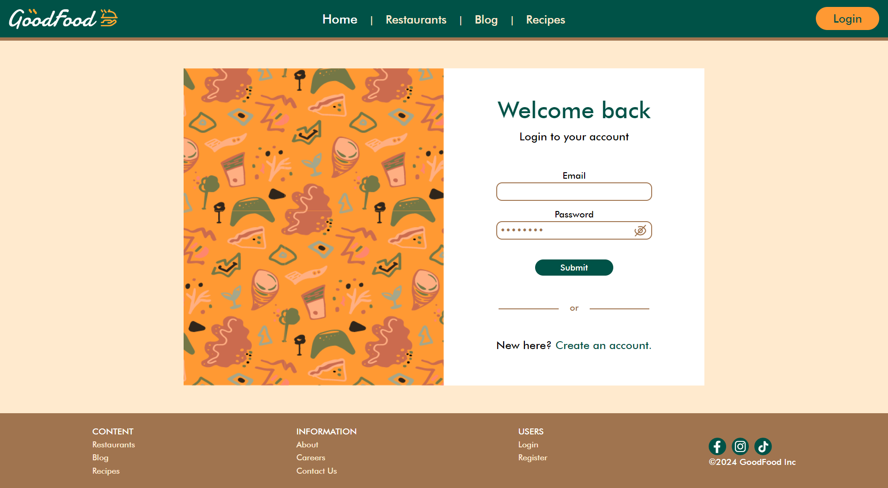
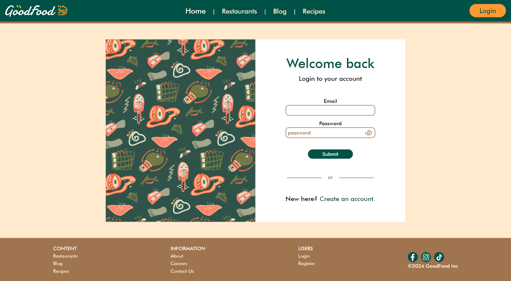

### User Login Page

• **Image:** Each time the user hovers over the image, it will change to 1 of 3 programmed images.

• **Logging In:** The user will need to input their email & account password to login. An alert will inform them if they have successfully logged in or if their email/password is invalid. Upon, logging in, their userID is saved into localStorageand used across the website to inform the pages that someone is currently logged in.

• **Password Visibility:** Users can click on the eye button to show or hide their password. This uses JavaScript to change the input field’s type and the image source each time its clicked.

• **Create an account:** If a user does not have an account, they can click the link below to access the registration page.

 

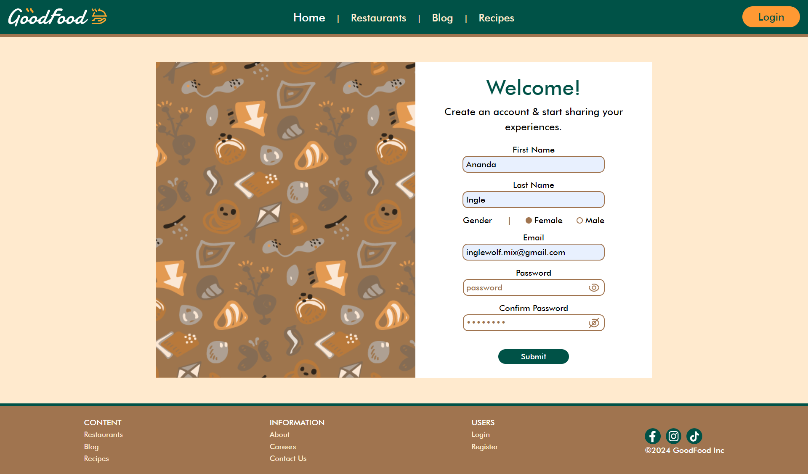

### New User Sign Up

• **Image:** Each time the user hovers over the image, it will change to 1 of 3 programmed images.

• **Password Visibility:** Users can click on the eye icon to show or hide their password. This uses JavaScript to change the input field’s type and the image source each time its clicked.

• **Fields:** Users need to be fill in all fields before submitting. An alert will inform them if they try submitting the form with blank fields.

• **Gender:** The user must select their either one of the options using the radio buttons.

• **Upon submission:** They will receive an alert to inform them of their account creation and then be directed to the login page, to access their new account. A JavaScript function sends the new user’s details to the database.

 

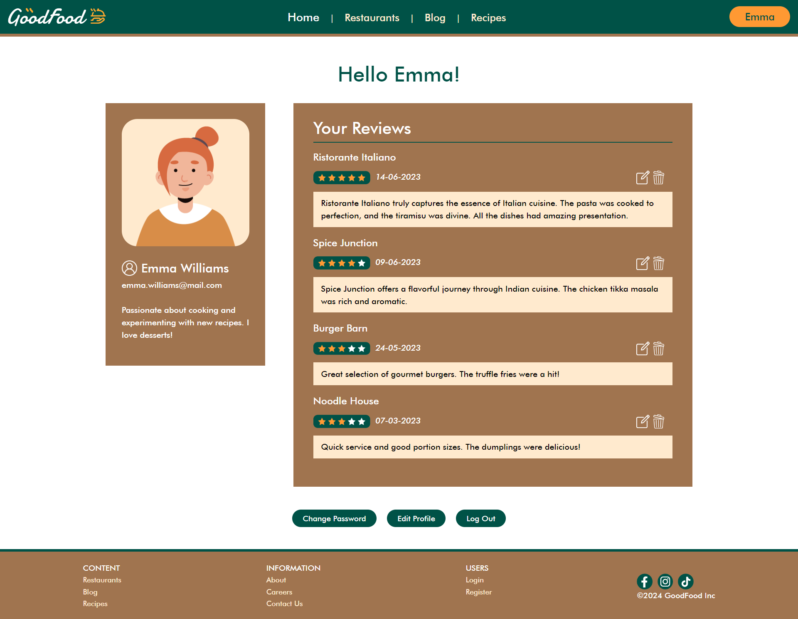

### User Profile

• **User Details:** Users can view their name, email and bio here.

• **Reviews:** Users can view all their reviews on their profile. They can also click into the edit or delete buttons above each review to manipulatethem. Upon clicking, the review’s id is passed asa parameter into the delete function and another function saves the id into localStore before redirecting the user to the Edit Review page.

• **Change Password:** Users can click this button & change their password on the destination page.

• **Edit Profile:** Users can click this button to edit their profile details.

• **Log Out:** Users can log out of their profile usingthis button. A JavaScript function will remove their userID from localStorage so the website knows no one is logged in and behave accordingly

 

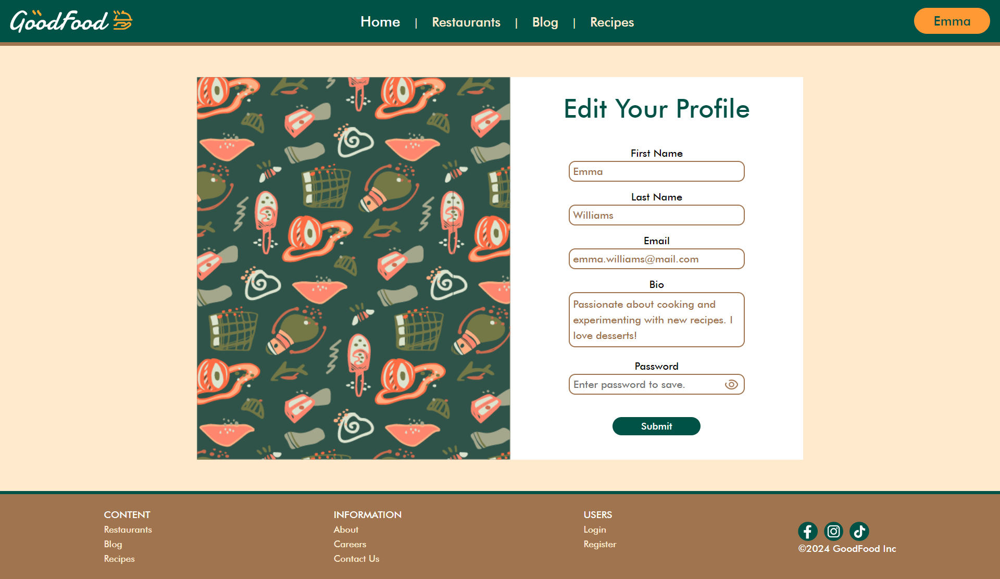

### Edit Profile

• **Image:** Each time the user hovers over the image, it will change to 1 of 3 programmed images.

• **Password Visibility:** Users can click on the eye icon to show or hide their password. This uses JavaScript to change the input field’s type and the image source each time its clicked.

• **Edit Data:** The various fields will be auto-populated with the user’s data. The user will be able to edit each field to modify their data. They will need to enter their correct password to be able to submit and save the changes.

• **Bio:** Users can choose to leave their bioempty but everything else should be filled.

 

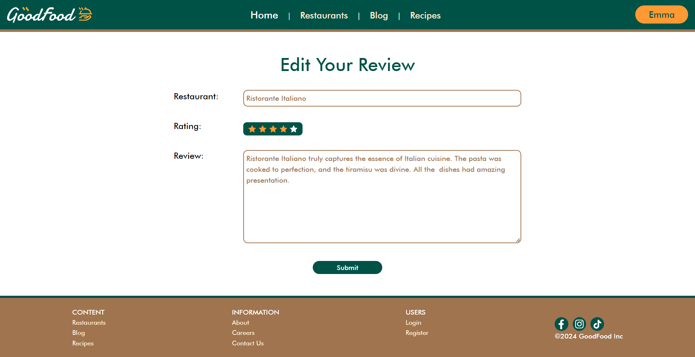

### Edit Review

• **onLoad:** The various fields will be auto-populated with the review’s data from the database, by using its id that was saved in localStore on the previous page. The user will be able to edit the rating and the review but not the restaurant’s name. 

• **onClick:** A JavaScript function communicates with the server to update the review’s record in the database. It then directs the user back to their profile.

 

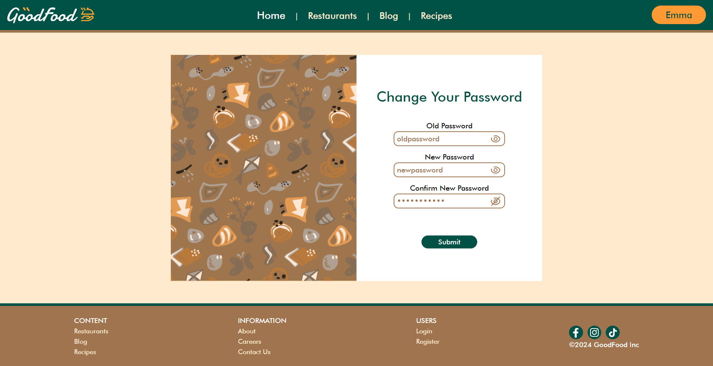

### Change Password

• **Image:** Each time the user hovers over the image, it will change to 1 of 3 programmed images.

• **Password Visibility:** Users can click on the eye icon to show or hide their password. This uses JavaScript to change the input field’s type and the image source each time its clicked.

• **Required:** The user will need to fillin all 3 fields to successfully changetheir password. Otherwise, an alert will remind them.

• **onClick:** The JS function will first compare if the new and confirmed password are the same. If its not, an alert will be produced. If it is, their new password will be updated in the database and they will be brought back to their profile page.

 

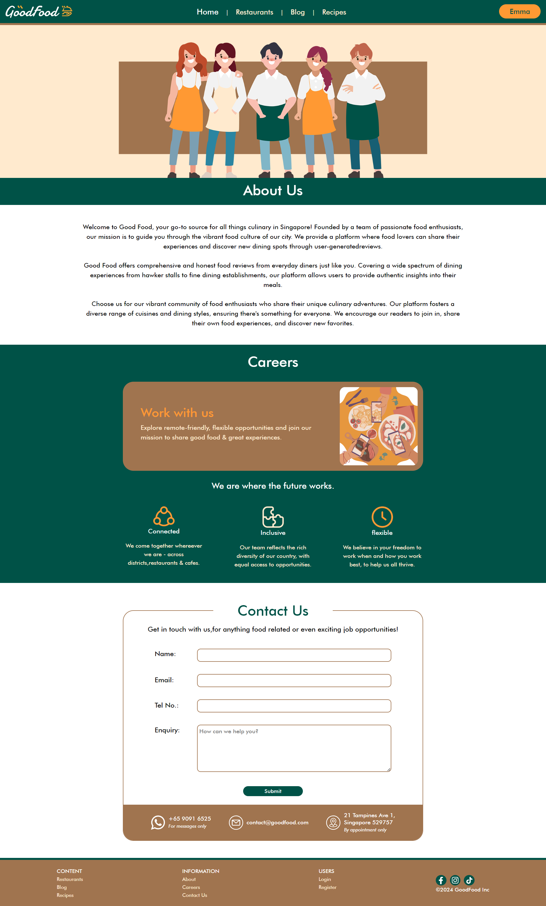

### About Us

• About Us, Careers & Contact Us will be placed on the same page. Users can simply scroll down to 
view the other sections.

• This section of the page displays a description of the review company together with their logo.

### Careers

• The careers section tells users about work opportunities with the company

### Contact Us

• This section of the page features an enquiry form that users can use to submit queries quickly to the company.

• It also displays the contact information of the company.

• **onClick:** A JS functionwill send the enquiry tothe database, for review by staff members. Allfields are required except for the user’s telephone number.

 

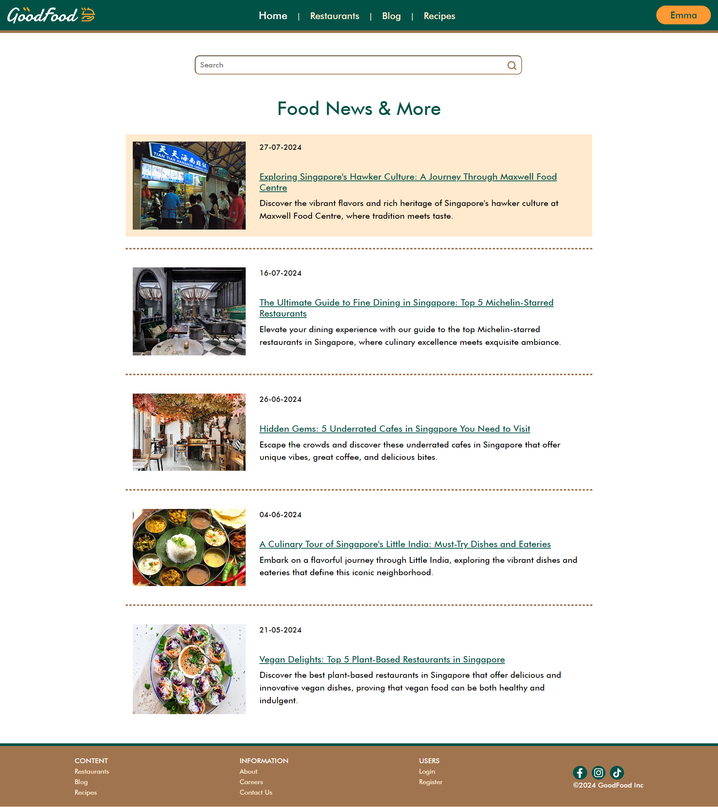

### Blog

• **onload:** A JS function loads a preview of each article from the database. Each row will contain an image, the article’s title and a short description. The user can clickanywhere on the article preview to access thefull article on the next page.

• **onHover:** When the mouse is over an articlepreview, the background colour is changed by a JS function to show that its highlighted.

• **onClick:** When a user clicks an article, its id number is saved in localStorage.

 

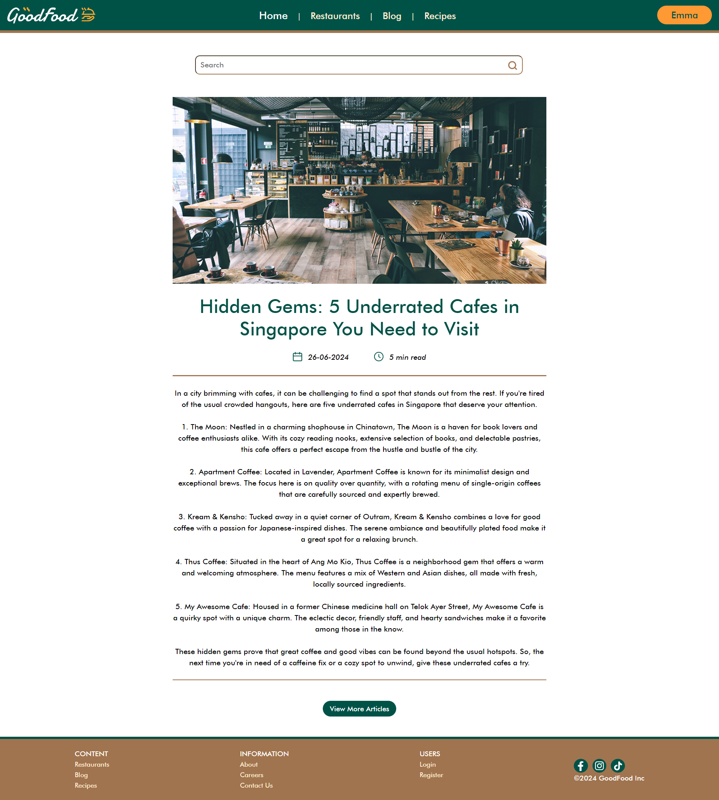

### Blogpost

• **onLoad:** A JS function uses the article’s id to retrieve all its details from the database. It then manipulates the HTML to display the article. Each article will have a banner image, a title, the date it was posted, approximation of read time and the article itself.

• **Back button:** Users can go back to the main blog by clicking the button at the bottom of the article.

 

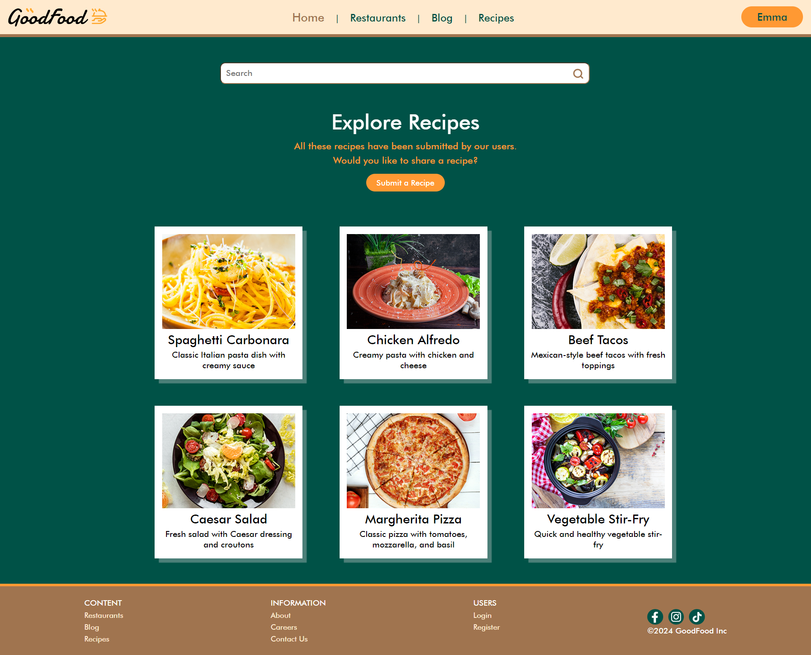

### Recipes

• **Recipe preview:** This page features previews of recipes submitted by users. Each grid consists of an image, the name of the recipe and a short description. Users can click on the grid to access the full recipe.

• **onClick:** When the user click on a grid tile, the recipe’s id number is saved in localStorage.

• **Submit a recipe:** Users can click this button to submit a recipe. A JS function first checks if they logged in by accessing the saved user id in the localStorage. If it's not available, they will be directed to the login page.

 

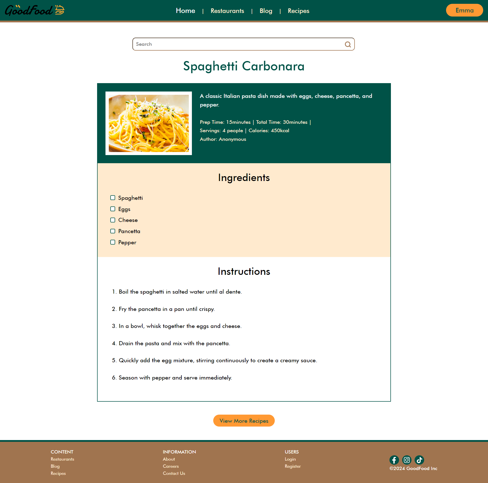

### Recipe Card

• **onLoad:** A JS function uses the recipe’s id saved in localStorage to retrieve the rest of its details from the database and insert it into the HTML code.

• Each recipe cared will have a title, image, description, ingredients list and instructions.

• **Ingredients:** Each item on the list will be accompanied with a check box. Users can check them as they follow along the recipe and gather ingredients. 

• **View More Recipes:** Users can navigate back to the main recipes page by clicking this button.

 

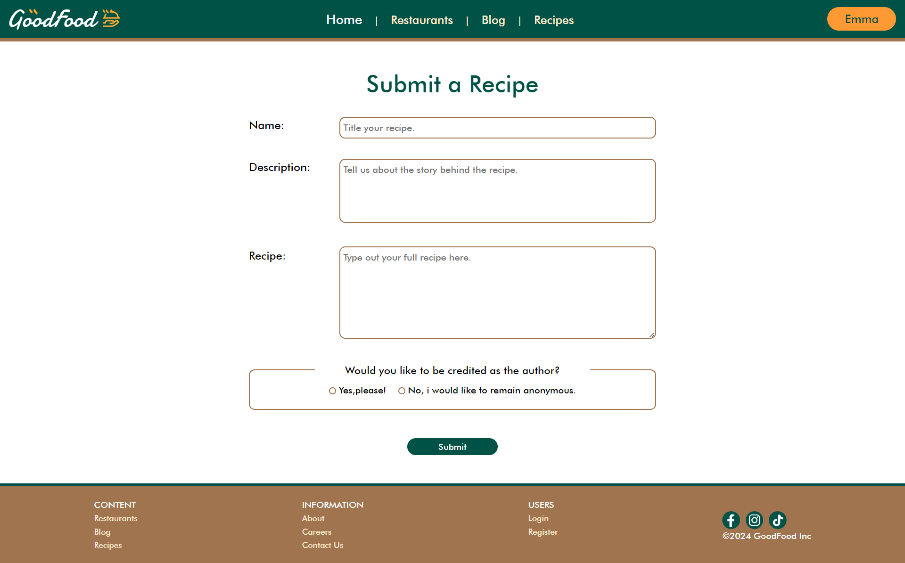

### Submit Recipe

• On this page, users can input the recipe name, description and instructions. They can also choose if they wish to be recognized for their recipe, by selecting the appropriate radio button. All fields are required.

• **Submit:** When the user clicks this button, a JS function will send their submission to the database, to be reviewed by a staff member.

## Possible Improvements

• **Search Bar:** The addition of a functional search bar would make navigating the entire website much easier. However, the implementation of it seemed complicated. So, I decided to pass it for now, in order to stick with the project’s deadlines.

• **Security:** Using encryption to store users’ passwords in the database / localStorage would greatly improve the security of the website. 

• **Using cookies:** Cookies seem to work the same way as how I have used localStorage to hold the ids of the user and other elements. However, I chose to use localStorage as it seemed to a much more straightforward approach. I wonder if using cookies would have helped improve the functionality of my website.

• **User Interactivity:** Implementing things like slideshows, using videos, more images, or coding interactive elements such as a responsive background that behaves according to the section of the site the user is in, would have greatly improved the user’s experience of the website and make it much more exciting.

## Reflection

Building the website from scratch was a positive experience for me. I was slightly over-ambitious with the number of pages I wanted to implement in my site, but at the end of semester, I had managed to complete them and make them to do the things I wanted. Having this many pages also gave me the opportunity to explore more ways of integrating HTML,CSS and JavaScript to make each page functional.

This project involved a lot of Googling especially for CSS properties as I wanted explore all the elements that could be styled. My experience as a graphic designer came into play and I wanted to create a site that was not just functional, but also aesthetically pleasing. 

I had initially struggled with the back-end coding and getting my JavaScript functions to work. But as I completed each page, I got the hang of how the POST, GET and DELETE requests worked. This required me to refer to tutorial pages on W3Schools and forums on Stack Overflow. I also learned how to use console.log() and alert() for debugging as much as possible, to track how mydata moved and if they were in the intended formats.

This project allowed me to work creatively. As someone, without any background in building websites from scratch, I was giventools in the form of lessons. Using what I learnt, I had to produce solutions for the things I wanted my site to do. I have learnt that theres almost nothing you can't do. It's just a matter of figuring how to code it. 

My proudest moment during this project was making the set of radio buttons used for the rating look like an actual rating barand not just a group of round buttons. It took me almost 3 hours to figure out how to change the visual of the rating stars whenever they were clicked on. I am sure there are easier ways to do it, but they are probably more complex too. This seemed a simple enough solution for my level of understanding. It took me 3 hours but the satisfaction when i completed it was worth it.

## References

• Color Palette: mycolor.space  
• Icons, Images & Other Resources: freepik.com, google.com  
• Inspiration: eatbook.sg & sethlui.com  
• Fonts: Google Fonts  
• Logos: looka.com  
• Tutorials: w3schools.com / stackoverflow.com/questions

